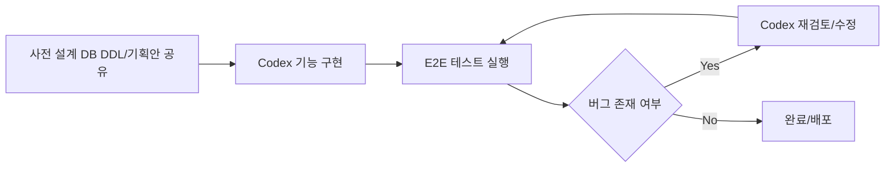
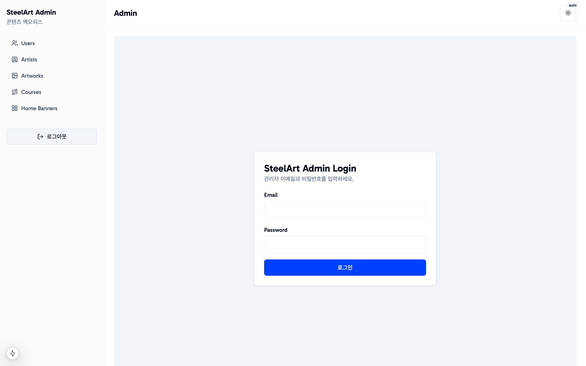
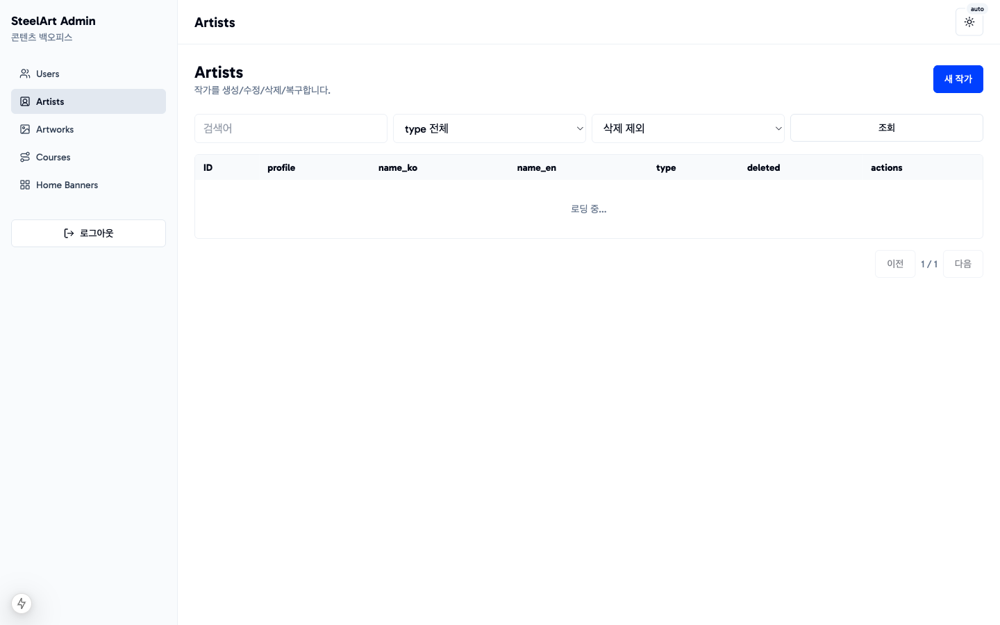
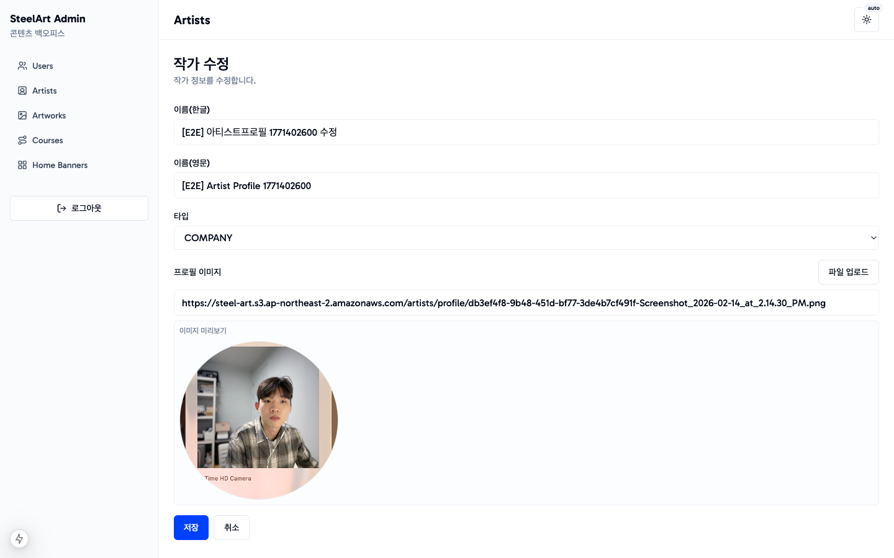
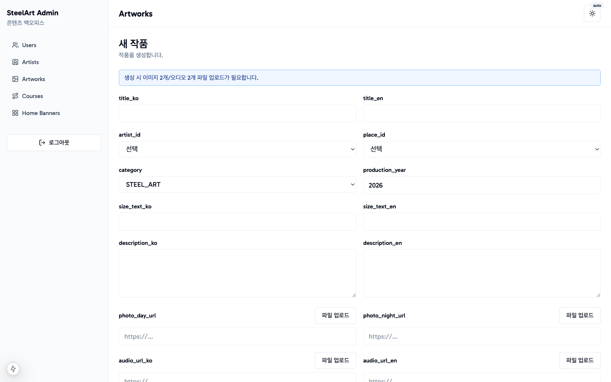
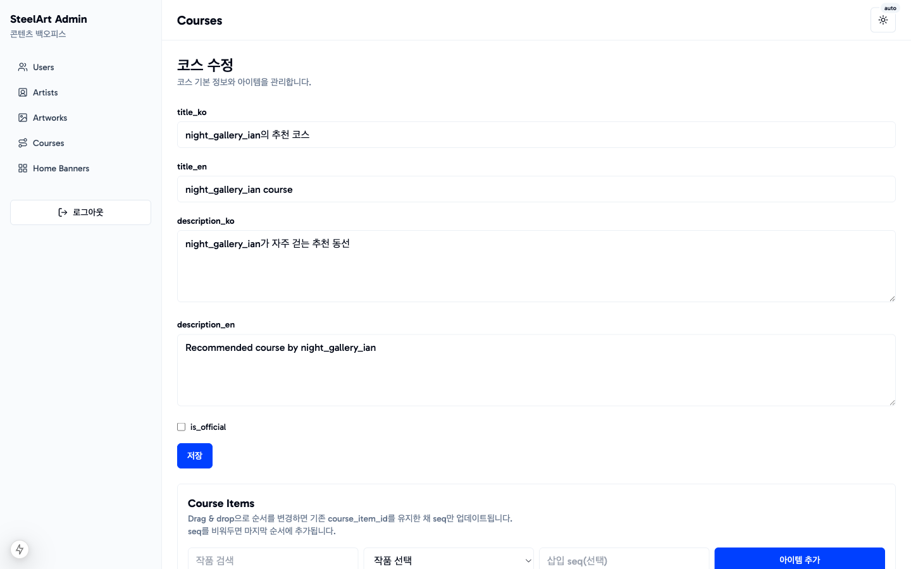

# SteelArt Admin Backoffice

포항문화재단 스틸아트앱 운영을 위한 백오피스 관리자페이지 프로젝트입니다.
**포항문화재단 스틸아트앱 백오피스 관리자페이지**

**100% 바이브 코딩으로 기획-구현-검증 루프를 완성한 개발자 포트폴리오 프로젝트**

## 프로젝트 개요

SteelArt 모바일 앱에 노출되는 콘텐츠를 운영팀이 빠르게 관리할 수 있도록 제작한 관리자 웹입니다.
작가, 작품, 코스, 홈 배너, 사용자 데이터를 한곳에서 관리하고, 운영 중 데이터 정합성을 지키는 정책까지 반영했습니다.

핵심 목표는 아래 3가지였습니다.
1. 콘텐츠 운영 속도 향상
2. 관리자 작업 실수 방지(검증/정책/권한)
3. 운영 데이터 보호(course checkin/순서 정합성)

## 핵심 페이지 & 기능

### 1) Login (`/admin/login`)
- NextAuth Credentials 기반 관리자 로그인
- `/admin/*` 페이지 보호 및 `/api/admin/*` 인증 보호

### 2) Artists (`/admin/artists`)
- 목록/검색/필터/페이지네이션
- 생성/수정/soft delete/restore
- 프로필 이미지 업로드(S3 presign) + 원형 프리뷰

### 3) Artworks (`/admin/artworks`)
- 작품 CRUD + 검색/필터
- 이미지/오디오 업로드(S3 presign)
- 업로드 파일 프리뷰(이미지/오디오)

### 4) Courses (`/admin/courses`)
- 코스 CRUD
- 코스 아이템 추가/삭제/재정렬
- `course_items.id` 유지 재정렬 및 checkin 보호(409)

### 5) Home Banners (`/admin/home-banners`)
- 배너 등록/활성화/순서 변경
- 하드 삭제 + `display_order` 재정렬

### 6) Users (`/admin/users`)
- 가입 사용자 목록/검색/필터/페이지네이션
- 사용자 상세(활동 요약, 생성 코스/좋아요/스탬프 확인)

## Codex 협업 개발 방식

이 프로젝트는 아래 프로세스를 반복하면서 개발했습니다.

1. 사전에 설계한 DB DDL 자료와 기획안을 Codex에 공유하고, 이를 기준으로 기능 단위 구현을 진행했다.
2. 구현 후 E2E 테스트를 반복 실행해 버그를 재현했다.
3. 버그 발생 시 Codex가 로그/화면 기준으로 재검토하고 수정하여 안정화했다.



## 기술 스택

- Framework: Next.js 15 (App Router)
- Language: TypeScript
- UI: Tailwind CSS, shadcn/ui
- State/Form: Jotai, React Hook Form, Zod
- Auth: NextAuth (Credentials)
- DB: MariaDB (RDS), mysql2 raw SQL
- Storage: AWS S3 (Presigned URL)
- Infra: Vercel
- QA: Playwright 기반 E2E 검증 루프

## 스크린샷 갤러리

### 01. 로그인 페이지


### 02. Artists 목록 페이지


### 03. Artist 수정 페이지(프로필 이미지 프리뷰)


### 04. Artworks 생성 페이지(업로드 필드)


### 05. Courses 상세 페이지(코스 아이템 편집)


### 06. Home Banners 운영 페이지


## 로컬 실행 방법

1. 환경변수 파일 준비
```bash
cp .env.example .env
```

2. 의존성 설치
```bash
pnpm install
```

3. 개발 서버 실행
```bash
pnpm dev
```

4. 선택 실행 스크립트
```bash
pnpm db:schema:export
pnpm db:seed:mock
pnpm db:backfill:artist-profile
```

## 포트폴리오 포인트 요약

1. 운영형 백오피스에서 중요한 데이터 정합성 정책을 API/DB/UX까지 일관되게 구현
2. S3 업로드, 인증, CRUD, 순서 관리, 보호 로직까지 실서비스 관점으로 통합
3. Codex와의 바이브 코딩 방식으로 빠르게 구현하고 E2E 루프로 품질을 끌어올린 개발 프로세스 증명
