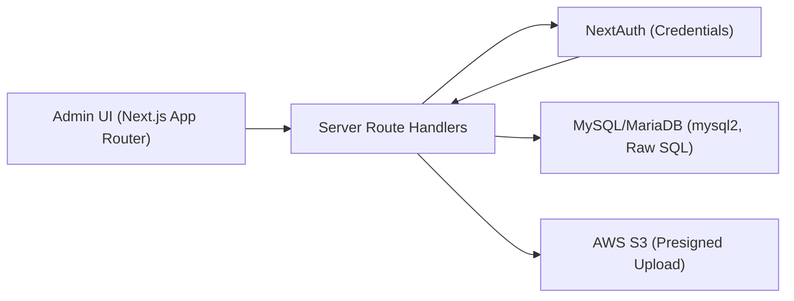
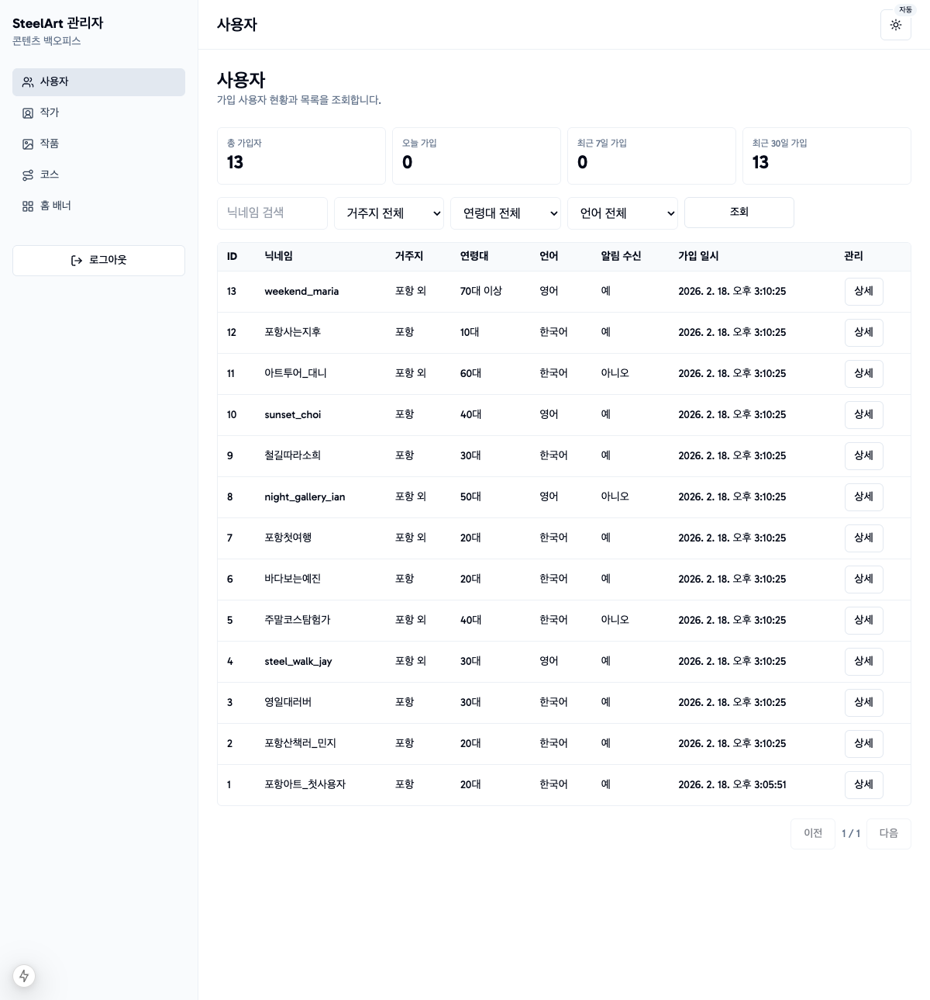
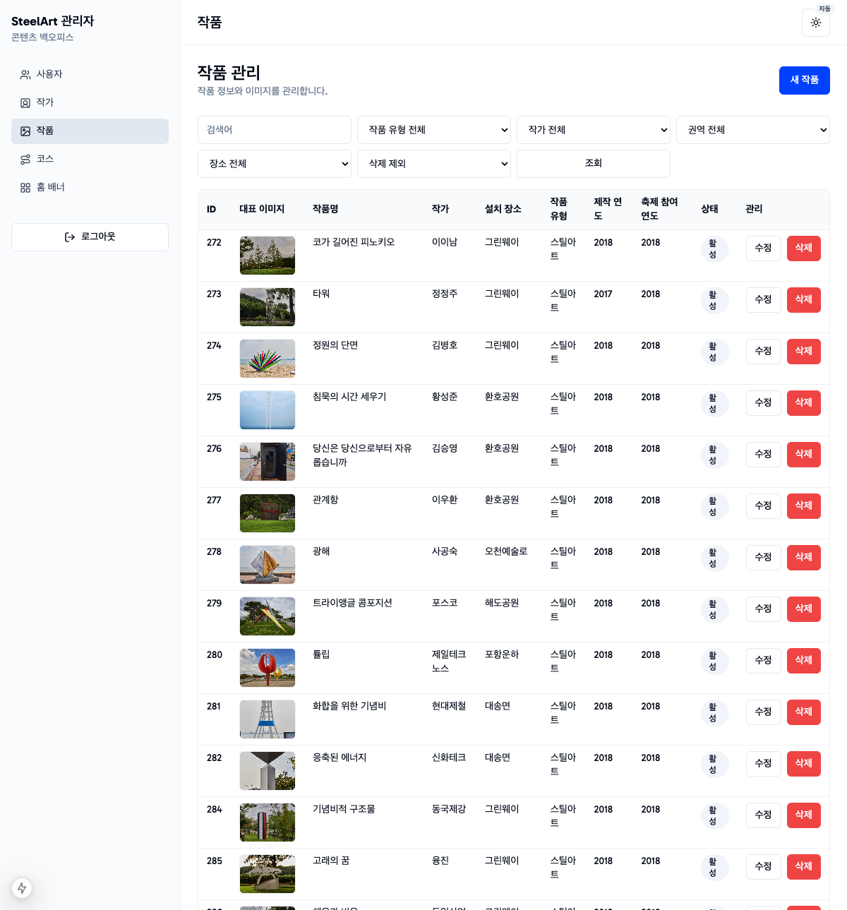
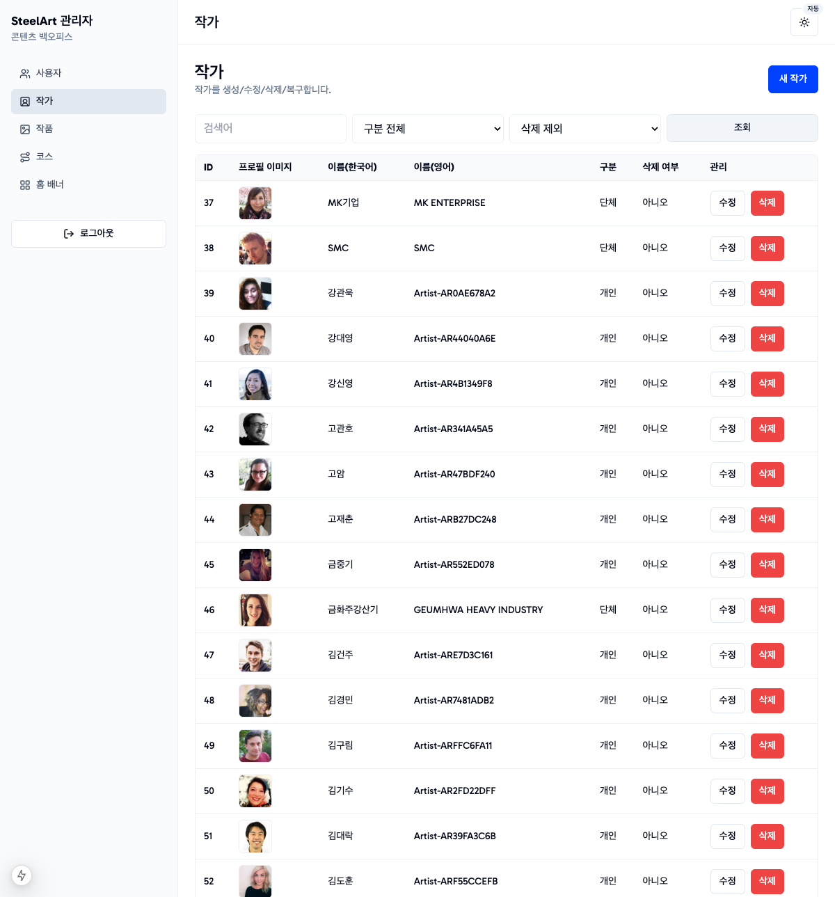
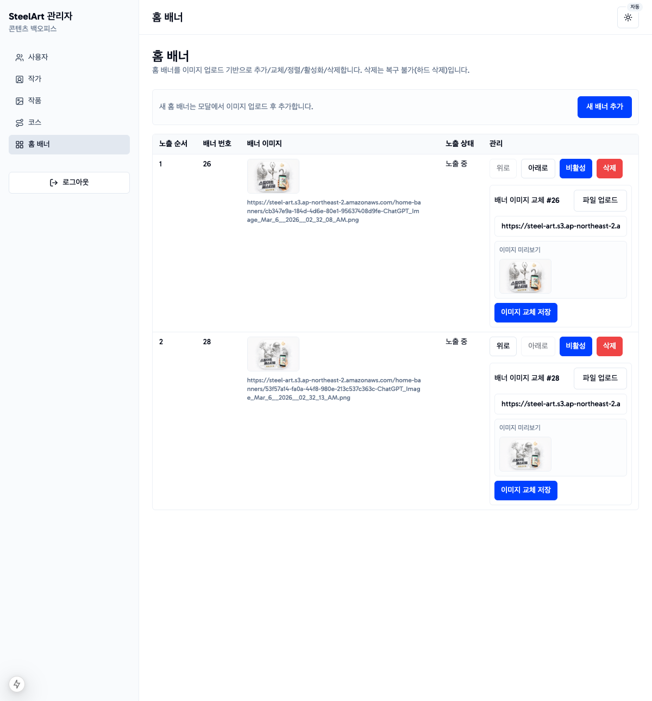
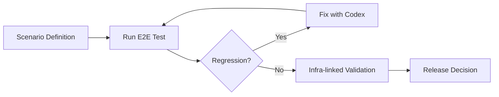

# SteelArt Admin Dashboard: AI-Collaboration Engineering Case Study

## 1. TL;DR
- 이 문서는 단순 구현 회고가 아니라, `Human-led Architecture` + `AI-accelerated Development` 운영 방식을 검증한 `workflow validation document`다.
- 긴급 데드라인을 맞춘 사례가 아니라, `Spec-first` 접근을 실제 프로젝트에 적용했을 때의 구현+검증 리드타임 결과를 정리한 문서다.
- 결론은 기능 수가 아니라 프로세스 재현성이다. `AI-native workflow`를 설계-구현-검증 루프에 고정해 반복 가능한 팀 실행 모델로 만들었다.

## 2. Project Context & Constraint
- 모바일 앱 운영을 위한 관리자 기능이 필요했지만, 사용자 서비스 디자인이 완성되기 전에 관리자 백오피스를 먼저 구축해야 했다.
- 운영팀은 빠르게 사용할 수 있는 MVP를 원했지만, "오늘 안에 끝내야 하는" 긴급 일정 압박이 있었던 것은 아니었다.
- 제약은 짧은 리드타임 자체보다, 설계 불확실성이 남아 있는 상태에서 운영 가능한 기준을 먼저 확정해야 한다는 점이었다.
- 따라서 우선순위는 다음과 같았다.
- 완전한 기능 확장성보다 운영 가능한 baseline 확보
- 복잡한 추상화보다 명확한 도메인 모델과 데이터 정합성
- 빠른 코드 생성보다 검증 가능한 설계 기준 확보

## 3. Human-led System Design
초기 설계는 코드가 아니라 도메인 합의에서 시작했다. 미팅 내용에서 운영 주체와 데이터 책임 경계를 먼저 정리하고, 이를 바탕으로 AI를 활용해 ERD 초안을 생성했다.
관리자 시스템의 스키마 초기 결정은 high-leverage다. 권한, 운영 정책, 데이터 정합성 규칙이 테이블 구조에 고정되고 이후 변경 비용이 빠르게 커지기 때문이다.
수동 검증이 없었다면 중복 속성, 모호한 관계, 과도한 분리로 인해 조회 복잡도와 운영 실수가 함께 증가할 수 있었다.

진행 방식은 다음과 같았다.
1. 미팅 기반으로 엔터티 후보(예: 작가, 작품, 코스, 배너, 사용자)를 먼저 확정
2. GPT로 ERD draft 생성
3. 엔터티별 attribute를 수동 검증
4. 관계(1:N, N:M) 정규화 및 불필요 조인 제거
5. 운영 MVP 범위를 벗어나는 over-engineering 요소 제거

Caption: AI-generated draft, manually validated.

Caption: Normalized and optimized schema after validation.

시스템 구성은 아래처럼 단순하고 책임이 분명한 구조로 고정했다.

## 4. Operational Surface (What Was Actually Built)
아래 화면은 "기능 나열"이 아니라, 설계된 아키텍처가 실제 운영 책임을 감당하는지 확인한 증빙 표면이다.

**User Management**

운영 책임: 관리자 접근 권한과 계정 상태를 통제해 운영 리스크를 줄이는 통제 지점.

**Artwork Management**

운영 책임: 작품 메타데이터와 공개 상태를 일관되게 유지해 전시/노출 품질을 관리하는 편집 허브.

**Artist Management**

운영 책임: 작가 프로필과 작품 연결 정보를 정합성 있게 유지해 콘텐츠 신뢰도를 보장하는 마스터 데이터 화면.

**Banner / Content Management**

운영 책임: 홈 노출 우선순위와 게시 상태를 조정해 운영 메시지 전달 타이밍을 관리하는 배포 표면.

요약하면, 화면은 중심이 아니라 결과물 검증의 인터페이스였다. 중심은 여전히 설계 기준과 검증 루프였다.

## 5. AI Collaboration Workflow (Vibe Coding Process)
구현은 `Plan Mode` 기반의 `Spec-first, generation-second` 원칙으로 진행했다. 즉, 코드를 먼저 만들지 않고 명세를 먼저 잠갔다.
중요했던 점은 도구 선택 자체보다, 생성 전 명세를 반복 수정한 상호작용 루프였다.

생성 전 interaction loop:
1. 초안 스펙 작성
2. Codex 제안 검토 및 반례 제시
3. 쿼리/인프라 영향 재검토 후 스펙 수정
4. `spec freeze` 이후 코드 생성

Plan Mode에서 확정한 핵심 결정은 다음과 같다.
- `Next.js`: App Router 기반으로 UI + API 경계를 단일 리포에서 관리
- `shadcn/ui`: 빠른 조합형 UI 구축과 커스텀 용이성 확보
- `mysql2 (raw SQL)`: 초기 MVP에서 ORM 학습/추상화 오버헤드를 줄이고 쿼리 제어권 확보
- `NextAuth (Credentials)`: 단일 관리자 인증 시나리오에 맞는 최소 인증 복잡도

명세 확정 전 검토 항목:
- 목록/상세/정렬 시 쿼리 round-trip 증가 가능성
- 조인 쿼리와 페이지네이션 비용
- S3 presigned upload 흐름과 DB 업데이트 타이밍 정합성
- 인프라(Vercel + RDS/S3) 연결 제약

Caption: Spec-first, generation-second approach.

## 6. Parallel Responsibility Strategy
개발 속도를 높이기 위해 역할을 명시적으로 병렬화했다.

- Codex 책임: 확정된 스펙 기준으로 애플리케이션 코드 생성 및 수정
- Human 책임: AWS S3, MySQL 환경 구성 및 운영 관점의 설정 검증

이 분리 전략의 장점:
- AI가 잘하는 반복 구현을 가속하면서도
- 시스템 경계/보안/인프라 리스크는 사람이 직접 통제할 수 있었다.

## 7. e2e Validation Loop
완성 기준은 "코드가 작성됨"이 아니라 "실인프라에서 동작 확인됨"이었다.

검증 루프:
1. Codex와 e2e 시나리오 설계
2. `Test -> Fix -> Test` 반복
3. S3/MySQL 실제 연결 상태에서 재검증
4. 실패 케이스(권한, 업로드, 데이터 정합성)까지 확인

Caption: Iterative validation before release.

## 8. Where AI Was Not Enough
AI는 구현 속도를 높였지만, 아래 영역은 인간 판단이 필수였다.

- 과설계 위험 통제: "미래 확장" 명목의 불필요한 추상화/테이블 분리 제거
- 쿼리 성능 검토: 실제 데이터 볼륨을 가정한 조회 패턴과 인덱스 필요성 판단
- 실제 인프라 연결 검증: 로컬 통과와 운영 환경 동작은 별개의 문제로 취급
- `Decision Boundary` 유지: 배포 가능 여부, 리스크 수용 수준, 예외 처리 기준은 사람이 최종 결정

요약하면, AI는 implementation partner였고, architecture owner는 끝까지 인간이었다.

## 9. Productivity Outcome
- 실행 결과: `spec freeze` 이후 구현 + 실인프라 검증까지 약 8시간 소요
- 해석 기준: 긴급 납기 달성 사례가 아니라, 재작업을 줄인 `Spec-first AI-native workflow`의 실행 결과

**What Improved**
- 명세 고정 이후 구현 리드타임이 단축되었다.
- 반복 수정 사이클에서 문제 재현과 패치 속도가 빨라졌다.
- 배포 시점 기준 치명 이슈 없이 동작 확인까지 도달했다.

**What Did Not Change**
- 요구사항 해석 충돌을 줄이기 위한 사전 합의 비용은 여전히 필요했다.
- 실인프라 검증은 로컬 성공과 별개로 별도 시간을 요구했다.

**What Remained Human**
- 스키마/쿼리 품질 판단과 과설계 억제.
- 리스크 수용 수준 정의와 release readiness 최종 결정.

## 10. How This Applies to Real Organizations
조직 적용은 도구 도입보다 `operating model` 정립이 먼저다. 이 프로젝트에서 검증된 패턴은 다음과 같이 확장할 수 있다.

1. AI PR Review automation
정적 규칙 + 컨텍스트 기반 리뷰를 결합해 반복 리뷰 비용을 줄이고, merge gate는 코드 오너십 체계와 함께 운영한다.
2. Internal RAG for domain knowledge
정책/용어/히스토리를 검색 가능한 내부 지식 레이어로 통합해 요구사항 해석 오류와 온보딩 학습 시간을 줄인다.
3. Documentation auto-generation
PR, 스펙, 운영 로그를 문서화 파이프라인에 연결해 최신 문서를 유지하고, 변경 추적과 감사 가능성을 강화한다.
4. Onboarding acceleration
신규 엔지니어가 코드보다 명세-결정 기록부터 이해하도록 학습 경로를 재구성해, 맥락 학습 시간을 단축한다.

AI는 구현 속도를 높일 수 있지만, 시스템의 책임 경계와 배포 판단은 인간이 가져야 한다. 생산성의 핵심은 자동 생성이 아니라 `decision ownership`을 유지한 협업 구조다.
